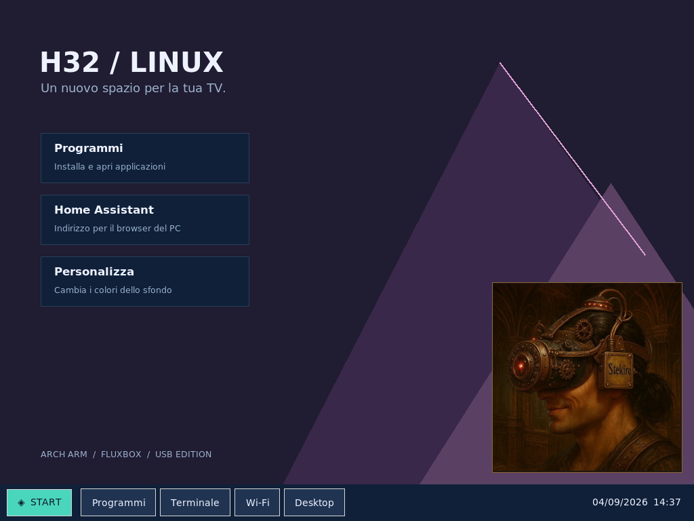
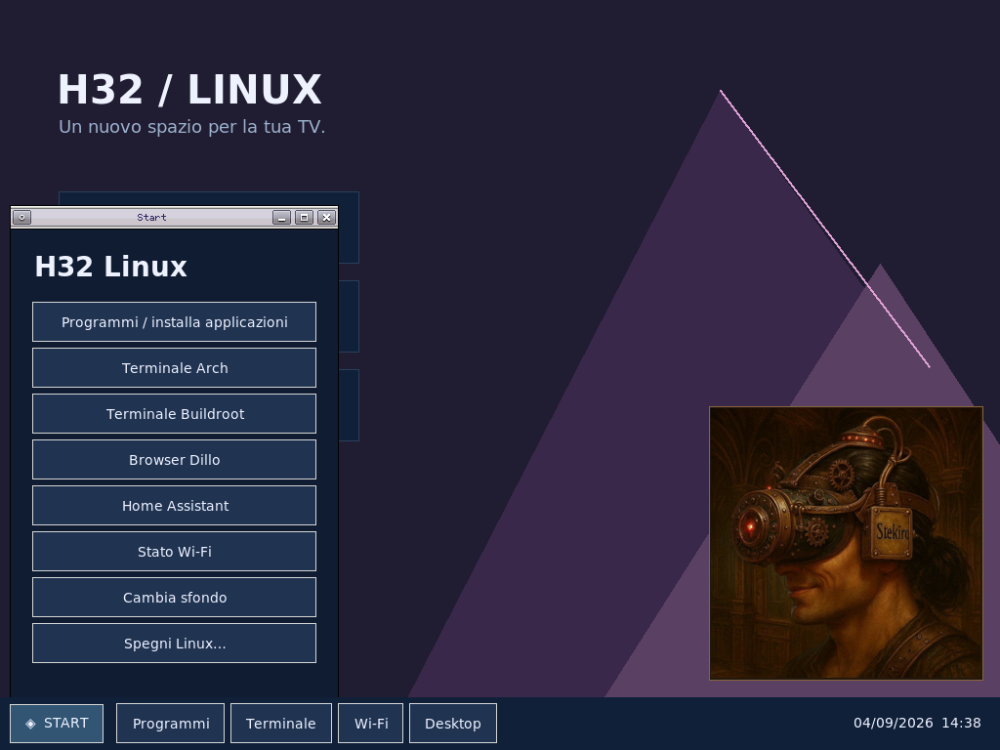
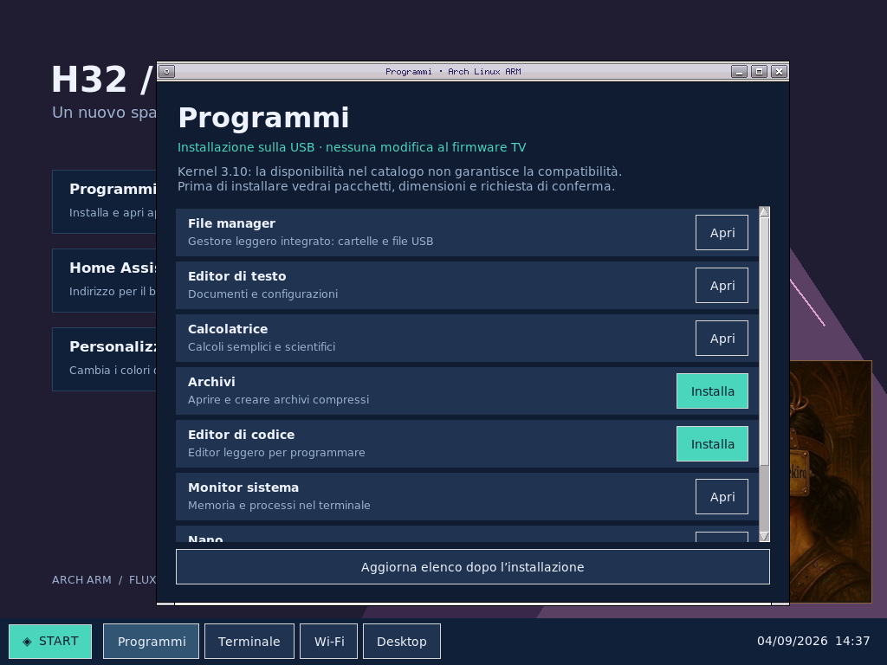

# H32 Linux — Hisense H32M2600 / MediaTek MT5882

Linux su chiavetta USB con desktop remoto, applicazioni leggere, Wi-Fi,
condivisione Windows e **audio dagli altoparlanti della TV**.
Configurazione collaudata su una specifica H32M2600, non firmware universale.

**Stato al 4 settembre 2026:** sistema USB utilizzabile; l'avvio richiede ancora
il selettore Windows/TTL. L'avvio automatico senza TTL **non è installato**.

## Guida

- **[Guida d'uso e preparazione](docs/GUIDA-ITALIANA.md)**
- [Audio permanente](work/README-audio-permanente-usb.md)
- [Suono di sistema pronto](work/README-ready-sound.md)
- [Condivisione Windows](work/README-samba-usb.md)
- [Desktop e programmi](work/README-h32-desktop.md)
- [Bootstrap e driver recuperati](work/README-usb-vendor-v1.md)
- [Limiti dell'avvio automatico](work/README-usb-multi-test.md)

## Funzioni verificate e limiti

| Funzione | Stato |
| --- | --- |
| Kernel | Linux vendor **3.10.27 SMP**, quattro core ARMv7 |
| Sistema | Buildroot USB con Arch Linux ARM in chroot; non Arch mainline |
| Desktop | Xvfb + Fluxbox + Python/Tk, VNC 1024×768 |
| Applicazioni | Menu Start, catalogo con conferma, file manager |
| Audio | FFplay + SDL/ALSA isolati, altoparlanti TV, mono 48 kHz |
| Suono di avvio | Quattro note a sistema pronto, confermate all'ascolto |
| Video | Riproduzione software provata; accelerazione GPU non verificata |
| Wi-Fi | MT7603U con driver e componenti WPA recuperati dalla propria TV |
| File Windows | Samba autenticato SMB2/3, cartella USB Condivisa |
| Home Assistant | Core sperimentale; avvio separato dalla melodia |
| Avvio senza TTL | **Non completato**, multi-image solo sperimentale |

La melodia attende audio, desktop, LAN, VNC e SMB, non tutti i programmi.
VNC non trasporta l'audio: il suono esce dalla TV. Un lettore audio per volta.

## Schermate reali

Acquisite dal desktop X11 della TV il 4 settembre 2026: non mockup né foto
del pannello. Non implicano accelerazione video o desktop sul pannello fisico.

## Hardware della macchina di prova

- Hisense H32M2600, mainboard famiglia RSAG7.820.7642.
- MediaTek MT5882 / Capri, Cortex-A7 quad-core ARMv7-A.
- DRAM rilevata: 1 GiB; circa 773 MiB utilizzabili da Linux.
- eMMC Hynix H26M31001HPR, circa 3,6 GiB rilevati dal sistema.
- U-Boot 2011.12.12, build 30 giugno 2017, prompt `mt5882 #`.
- UART 115200 8N1, adattatore CH340 su COM3 nel laboratorio.
- Lexar circa 16 GB, FAT32 per il boot ed ext4 per sistema e dati.
- Wi-Fi USB MT7603U, Ethernet; amplificatore audio TAS5711.

## Sicurezza

Il percorso **USB vendor / Buildroot** modifica le variabili U-Boot soltanto
in RAM. Non impartisce `saveenv`, flash o scritture dirette eMMC. Il servizio
audio verifica il root USB e imposta l'eMMC in sola lettura nel block layer:
questa protezione non equivale a una verifica di tutti i driver proprietari.

Esistono script storici per p27, preparazione dischi e ricerca: **non eseguire
tutti gli script in sequenza**. La preparazione di una chiavetta può cancellare
i suoi dati; non serve riformattare quella funzionante o modificare p27.

Non esporre VNC, Telnet, Samba o Home Assistant a Internet. Kernel vecchio e
shell privilegiata: laboratorio, non piattaforma per impianti critici.

## Contenuti

- `buildroot/`, `buildroot-bootstrap/`: configurazioni e overlay.
- `windows/H32BootSelector/`: sorgenti del selettore .NET 8 Windows.
- `work/`: integrazione, installer, esperimenti e note tecniche.
- `assets/audio/ready.wav`: melodia originale, generatore in `work/`.
- `assets/desktop/portrait.jpg`: sfondo fornito dall'utente.
- `docs/`: guida e schermate.

**Esclusi:** dump, kernel/firmware proprietari, moduli `.ko`, rootfs completi,
password, configurazioni Wi-Fi personali e backup credenziali. Un clone da solo
**non ricrea la USB funzionante**: servono artefatti locali e dipendenze compatibili.

## Dipendenze e diritti

[Buildroot](https://buildroot.org/), [Arch Linux ARM](https://archlinuxarm.org/),
[MediaTek Linux](https://github.com/yath/mediatek-linux-3.10),
[riferimento U-Boot](https://github.com/unitedcolorsofg/vizio_oss).
I componenti terzi conservano le loro licenze. Nessun diritto sul firmware
Hisense/MediaTek è concesso dal repository. L'immagine personalizzata conserva
i diritti del suo autore, separati dal codice.
